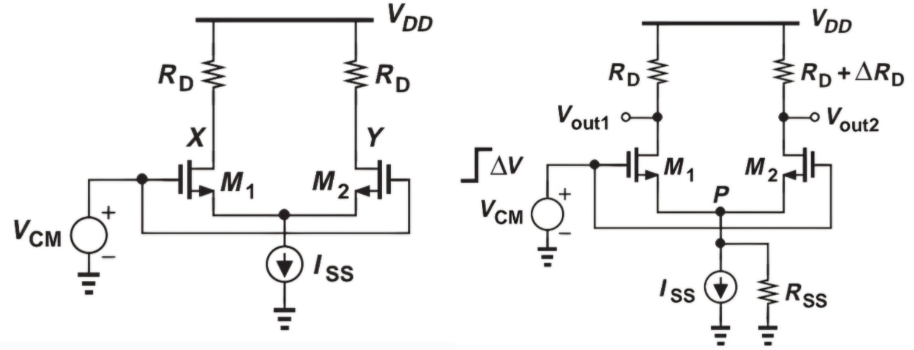

# Differential Amplifiers
&nbsp; It is difficult to make perfectly ripple-free DC voltage sources. For example, DC–DC
converters generate voltage by switching current paths. Although a low-pass filter
reduces the ripple, some ripple caused by switching is inevitable. Common-emitter (CE)
and common-source (CS) stages need two DC sources the supply voltage $V_{CC}$ and base voltage $V_{b}$
**To suppress the effect of ripples of these voltage sources on the output, we use a differential pair**.

&nbsp; Ideal differential pairs are perfectly symmetric, and the current sources have infinite
impedances. Changes in $V_{CM}$ do not affect the two output nodes so the differential
output does not change (common-mode gain is zero). The only constraint on $V_{CM}$ is that it must remain 
within a range that ensures the transistors stay in the proper operating region.

&nbsp; In practice, however, ideal differential pairs do not exist. First, the current source has finite impedance. 
As a result, ripples in $V_{CM}$ have effects on the output common-mode voltage $V_{CM,out}$, creating a nonzero **common-mode gain**.
As long as the circuit is perfectly symmetric, this does not affect the differential output. But if asymmetry arises—for example, due to manufacturing 
mismatch—then common-mode gain is converted into differential output. This effect is called **common-mode to differential-mode conversion** 
$A_{CM-DM} = \frac{ΔV_{out}}{ΔV_{CM}}$.

&nbsp; A larger differential gain generally leads to a larger $A_{CM-DM}$. The ratio of
differential gain $V_{DM}$ to $A_{CM-DM}$ is the **common-mode rejection ratio** (CMRR). 
 

