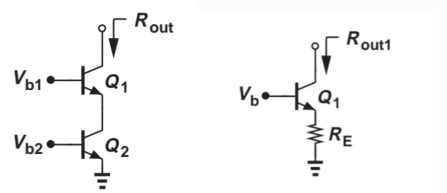

# Cascode stages
&nbsp; By using a degeneration transistor, we can achieve a higher output impedance in a CE/CS stage while requiring a nearly current-independent
headroom, unlike a degeneration resistor whose headroom-consume increases linearly with current. The voltage headroom refers to the upper 
and lower boundaries of the output voltage that must be maintained for the transistors to remain in their intended operating region.

&nbsp; The increased output impedance is useful in many applications, but the most important cases are **current sources and amplifiers**. An 
ideal current source with infinite impedance supplies the same current regardless of voltage changes. For example, once we turn on a faucet, we
would ideally expect the same amount of water to flow whether we attach a long hose or wash our hands directly. In reality, this is not true for
either water taps or electrical circuits, but it is what we aim for. To approximate this behavior, we use the cascode configuration, which adds a
degeneration transistor.

&nbsp; With higher output impedance, we also obtain higher gain, as shown by the equation $A_v=-G_m R_{out}$​. This equation can be derived
by converting the circuit into its Norton equivalent. The transconductance $G_m$  does not change significantly when we add the cascode transistor,
but $R_{out}$ increases greatly. 

# Current mirror
&nbsp; Changes in supply voltage and temperature lead to variations in **bias current**. **Bandgap reference circuits** provide a current that is 
independent of both temperature and supply voltage. Since many current sources must remain stable across these variations, bandgap reference circuits
are essential. However, they occupy a large area, so using them everywhere is not practical. Instead, **current mirrors** replicate the stable current
from one bandgap reference while occupying only a small area.

## Key Equations
- **Output Resistance (CE with Degeneration, general form)**
$$R_{out}=[1+g_{m1} (R_E//r_{π1})] r_{o1}+(R_E//r_{π1})$$
- **Output Resistance (CS with Degeneration, general form)**
$$R_{out}=[1+g_{m1} R_E] r_{o1}+R_E$$
- **Voltage Gain**
$$A_v=-G_m R_{out}$$
- **BJT current Mirror(ignoring base current)**
$$I_{copy}=\frac{I_{s1}}{I_{s,REF}} I_{REF}$$
- **BJT current Mirror**
$$I_{copy}=\frac{nI_{s1}}{1+\frac{1}{β} (n+1)}$$
- **MOSFET current Mirror**
 $ I_{copy}=\frac{(W/L)_1}{(W/L)_{REF}} I_{REF} $
